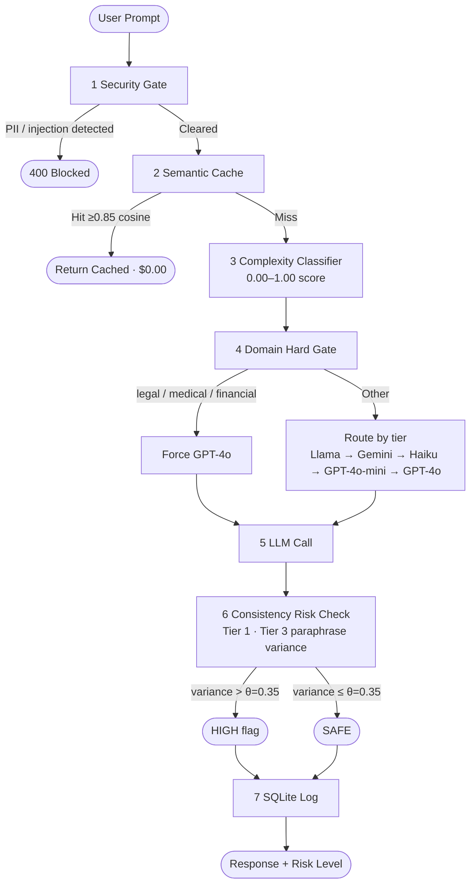

# Aegis — Multi-Provider LLM Gateway with Consistency-Based Hallucination Detection

> Cost-aware multi-model routing with response-consistency hallucination detection

Aegis is a production LLM gateway that routes every prompt to the cheapest capable model, detects hallucinations without requiring ground truth, and surfaces every architectural decision in a live dashboard.


**Live demo:** https://aegis-llm-gateway.vercel.app  
**Backend API:** https://aegis-llm-gateway.onrender.com/docs      
**Youtube Link** https://youtu.be/nbfz1spSwVc

---

## Problem Statement

Organizations using LLMs in production face two compounding problems:

1. **Cost waste** — Simple queries hit GPT-4o at $2.50/1M tokens when Llama 3.1 (free) or Gemini Flash ($0.075/1M) would answer just as well.
2. **Silent hallucinations** — LLMs produce confident, fluent, incorrect answers. In medical, legal, or financial contexts, this causes real harm. The core difficulty: in production, there is no ground truth to check against.

Aegis addresses both: hallucination detection without ground truth, via response consistency under prompt paraphrasing.

---

## Differentiation

OpenRouter and LiteLLM solve cost-aware routing well. Aegis adds two things they do not:

| Feature                          | OpenRouter | LiteLLM | Aegis |
|----------------------------------|:----------:|:-------:|:-----:|
| Multi-provider routing           |     ✓      |    ✓    |   ✓   |
| Semantic cache                   |            |         |   ✓   |
| Domain-gated security (hard rule)|            |         |   ✓   |
| Paraphrase-variance hallucination|            |         |   ✓   |
| Open source dashboard            |            |    ✓    |   ✓   |

**Paraphrase-variance hallucination detection without ground truth.**

Instead of asking "is this response correct?" — which requires ground truth — Aegis asks:

> *Does the factual claim change when only the phrasing changes?*

If a model's claim shifts when the question is paraphrased, the claim was not anchored to underlying knowledge, only to surface prompt features. This can be framed as a perturbation test on prompt surface form, analogous to a do-intervention in Pearl's framework — though we make no formal SCM identification claim. The technique belongs to the consistency-based hallucination detection family alongside SelfCheckGPT (Manakul et al. 2023) and semantic entropy (Kuhn et al. 2024); the contribution of Aegis is deploying this class of check as a *runtime gateway signal* rather than a research artifact.

The variance threshold (θ = 0.35) is calibrated on a 30-sample pilot set (15 factual, 15 hallucination-prone) for operational threshold tuning. This is not a published evaluation. A follow-up generalization study ([backend/eval_recalibration.py](backend/eval_recalibration.py)) found that paraphrase variance does **not** reliably predict a model's *subtle* factual errors on natural questions (held-out AUROC ≈ 0.5 on TriviaQA, labeling answers by model correctness, SelfCheckGPT-style) — at θ = 0.35 the check fires almost exclusively on blatantly fabricated-premise prompts. Tier 3 is therefore a narrow, high-precision safeguard against confabulated/nonexistent-entity prompts, not a general-purpose hallucination detector (see [Scope Boundaries](#scope-boundaries)).

---

## System Architecture

### Request Pipeline

```
Incoming Prompt
      |
[1] Security Gate
      |  — PII scan (email, SSN, phone regex)
      |  — Injection detection ("ignore previous instructions", "jailbreak", ...)
      |  — Domain hard gate: legal/medical/financial → force GPT-4o, no override
      |
[2] Semantic Cache (cosine similarity ≥ 0.85 → return cached, $0.00)
      |  cache miss ↓
[3] Complexity Classifier → Route to cheapest capable model
      |  Provider rotation: random.choice(pool) across primary + alternate providers per tier
      |
[4] LLM Call (unified async client, 3-retry with exponential backoff)
      |  fallback to gpt-4o-mini if primary provider unavailable
      |
[3.5] Consistency Risk Check
      |  — Tier 1: Hedging phrase scan [FREE, all providers, all requests]
      |  — Tier 3: Paraphrase variance vs θ=0.35
      |             [gated: legal/medical/financial OR complexity > 0.6]
      |
[5] Log to SQLite (cost, model, provider, latency, risk_level, cache_hit, domain)
      |
Response + causal_analysis { is_hallucination, confidence, explanation, pathway, variance_score }
```



---

## Scope Boundaries

- This is not a fact-checking or retrieval system — no external knowledge base is queried.
- The variance threshold (θ = 0.35) is an operationally motivated heuristic, calibrated on a 30-sample pilot labeled set (15 factual, 15 hallucination-prone): combined detector precision 0.82, recall 0.60, F1 0.69; Tier 3 alone achieves precision 0.67 at θ = 0.35. This is a pilot for operational calibration, not a published evaluation. A follow-up generalization study ([backend/eval_recalibration.py](backend/eval_recalibration.py)) tested whether paraphrase variance predicts model errors on natural questions — grading TriviaQA (`rc.nocontext`) answers by model correctness (SelfCheckGPT-style), with θ chosen on a train split and AUROC reported on a held-out test split. On natural questions gpt-4o-mini answers stably regardless of correctness (variance mostly < 0.15), so variance does **not** reliably predict subtle factual errors (held-out AUROC ≈ 0.5). At θ = 0.35, Tier 3 fires almost exclusively on blatantly fabricated-premise / nonexistent-entity prompts — which is what the pilot's hallucination class actually contained. It is a narrow, high-precision confabulation safeguard, not a general-purpose hallucination detector.
- Paraphrase variance detects response *instability*, not factual incorrectness. A confidently wrong but internally consistent answer will not be flagged.
- The cost-savings figure (40–60%) is computed against a worst-case GPT-4o-only baseline on a 50-record synthetic workload. Comparison against more realistic baselines (GPT-4o-mini-only, OpenRouter auto-routing) is future work.
- The `/api/domain-cost-breakdown` endpoint reports a subgroup cost breakdown by domain class — it is descriptive telemetry, not a causal inference result.
- This system is not a replacement for human review in regulated domains.

---

## Decisions held outside the automated pipeline

The following are hard-coded policy decisions, not learned or inferred at runtime:

- **Hard-gate categories** — legal/medical/financial domains always route to gpt-4o, regardless of complexity score
- **Routing band boundaries** — 0.20 / 0.45 / 0.65 / 0.80 — empirically tuned, not optimized
- **Hallucination threshold** — θ = 0.35 — calibrated on a 30-sample pilot, not on a published benchmark
- **Cache similarity threshold** — 0.85 cosine — chosen because 0.95 yields <1% hit rate in practice
- **Security keyword/regex lists** — see [security.py](backend/app/services/security.py) — manually curated
- **Model pool composition** — which provider serves which routing band — a policy choice, not optimized

These are policy. The automated pipeline operates *within* them; it does not modify them at runtime.

---

## Architecture Decisions

| Pipeline Stage | Business Need | Design Rationale |
|---|---|---|
| [1] Security Gate | Prevent harm before any model call | Deterministic rules — PII and injection must be caught 100%, not probabilistically |
| [2] Semantic Cache | Eliminate duplicate API costs | Cosine similarity ≥ 0.85 catches paraphrases that keyword caches miss |
| [3] Complexity Classifier | Route simple queries to cheap models | 4-factor weighted score; question type weighted 0.35 (dominant signal for model tier) |
| [4] Domain Hard Gate | Sensitive domains (legal, medical, financial) require the highest-safety model unconditionally — misrouting a legal or medical query to a cheaper model creates liability risk and potential patient/user harm that cost savings cannot justify | Runs before complexity classifier; cannot be overridden by any other factor |
| [5] LLM Call | Get a response from the routed model | Async with 3-retry + exponential backoff; provider rotation distributes load |
| [6] Consistency Risk Check | Flag responses that may be hallucinations, without ground truth | Paraphrase variance: perturb prompt surface form, measure response divergence |
| [7] SQLite Log | Observable, auditable, cost-trackable system | Every request logged with cost, model, latency, domain, risk level |

---

## Model Pool

| Score Range | Primary Model | Alternate | Cost per 1M Tokens |
|-------------|---------------|-----------|-------------------|
| 0.00–0.20 | Llama 3.1 8B (Groq) | — | $0.00 |
| 0.20–0.45 | Gemini 2.0 Flash | Claude 3.5 Haiku | $0.075 |
| 0.45–0.65 | Claude 3.5 Haiku | Gemini 2.0 Flash | $0.250 |
| 0.65–0.80 | GPT-4o-mini | Claude 3.5 Haiku | $0.150 |
| 0.80–1.00 | GPT-4o | — | $2.500 |

Routing is automatic — the complexity classifier scores each prompt (0.0–1.0) and routes to the cheapest model capable of handling it. Within each tier, **provider rotation** (`random.choice(pool)`) distributes live traffic across the primary and alternate providers, preventing OpenAI from dominating all mid-tier traffic.

Legal, medical, and financial queries are always hard-routed to GPT-4o regardless of complexity score.

Local Ollama (llama3.1) overrides Groq for the lowest tier if `OLLAMA_BASE_URL` is reachable — $0.00 cost, fully local.

---

## Dashboard

Live stats updated after every request:

**Live Routing Trace** — decision audit for the most recent request: routing confidence %, complexity band, optimal model with selection rationale, deduplication (cache hit/miss), response reliability score (PASS/FLAG + confidence %), actual cost vs GPT-4o baseline, per-query savings %.

**Provider Health Board** — real-time status for all five providers (OpenAI, Anthropic, Google, Groq, Ollama): active/unconfigured, average latency, and query count from the current session.

**Savings Accumulator** — cumulative cost efficiency across all routed requests: total queries, deduplication rate, total saved vs GPT-4o-only baseline, savings %, reliability incident count, avg latency.

**Charts** — model distribution (request volume vs cost share), cumulative savings over time (area chart), avg latency by model (bar chart), reliability distribution by tier (donut).

Dashboard pre-seeded with 50 realistic demo requests on first startup — real data is visible immediately before any prompts are sent.

---

## Quick Start

### Prerequisites
- Python 3.11+, Node.js 18+
- OpenAI API key (required — GPT-4o-mini + GPT-4o)
- Anthropic API key (Claude 3.5 Haiku)
- Google API key (Gemini 2.5 Flash)
- Groq API key (Llama 3.1 8B — free tier available)
- Ollama with `llama3.1` pulled locally (optional — falls back to Groq automatically)

### Backend
```bash
conda activate neu_work
cd backend
pip install -r requirements.txt
cp .env.example .env
# Add API keys to .env
uvicorn main:app --reload
```

### Frontend
```bash
cd frontend
npm install
npm run dev
```

### Endpoints
- Frontend: http://localhost:5173
- Backend API: http://localhost:8000
- API Docs: http://localhost:8000/docs

### Running Tests
```bash
cd backend
pytest tests/ -v
# 57 tests, ~8s, no real API calls made
```

---

## Technical Details

### Complexity Classifier

4-factor weighted score:

```python
score = (
    0.20 * vocab_richness(prompt)          +  # type-token ratio + avg word length
    0.20 * structure_score(words, sents)   +  # length and sentence count
    0.35 * question_type_score(verbs)      +  # factual vs analytical vs design (exclusive tiers)
    0.25 * domain_similarity                  # cosine sim to legal/medical/financial/technical prototypes
)
```

Routing table (list-of-pools with provider rotation):

```python
ROUTING_TABLE = [
    (0.20, [("llama-3.1-8b-instant", "groq")]),
    (0.45, [("gemini-2.5-flash", "google"), ("claude-haiku-4-5-20251001", "anthropic")]),
    (0.65, [("claude-haiku-4-5-20251001", "anthropic"), ("gemini-2.5-flash", "google")]),
    (0.80, [("gpt-4o-mini", "openai"), ("claude-haiku-4-5-20251001", "anthropic")]),
    (1.01, [("gpt-4o", "openai")]),
]
# route()             → returns pool[0] (deterministic, used in tests)
# classify_and_route() → random.choice(pool) (live rotation for real traffic)
```

Question type tiers are mutually exclusive — the highest matching tier wins (complex > analytical > factual). Routing confidence is computed from distance to the nearest tier boundary: scores near boundaries return lower confidence than scores deep in a band.

### Semantic Cache

In-memory cache using `sentence-transformers/all-MiniLM-L6-v2` (via fastembed ONNX). Threshold 0.85 (not 0.95 — that gives <1% hit rate in practice). Cache hit returns in ~5ms at $0.00.

The same embedder instance is shared between the cache and hallucination detector to avoid loading the model twice (~90MB).

**Cache invalidation:** the cache is in-memory only and resets on Render restart. There is no TTL. This is intentional for the demo deployment; a production deployment would use Redis with a sliding-window TTL of N minutes per query and is a known limitation.

### Security Layer

Three-gate check before any routing:
1. PII regex — blocks email, SSN (`XXX-XX-XXXX`), phone patterns
2. Injection detection — keyword list: `"ignore previous instructions"`, `"jailbreak"`, `"system:"`, etc.
3. Domain hard gate — `legal | medical | financial` → force GPT-4o. This bypass cannot be overridden by the classifier.

### Hallucination Detector (Tier 1 + Tier 3)

**Tier 1 — Hedging phrase detection (free, runs on all responses)**

Scans response for confidence-undermining phrases: `"I'm not sure"`, `"I believe"`, `"might be"`, `"as of my knowledge cutoff"`, etc. Three or more hits → flagged as potential hallucination (MEDIUM risk). Epistemic opener phrases (`"I think"`, `"it seems"`) count as 1-hit triggers regardless of quantity.

**Tier 3 — Paraphrase variance (gated)**

Only runs if `domain in (legal, medical, financial)` OR `complexity_score > 0.6` OR prompt contains factual question patterns (`"what did"`, `"when did"`, `"who said"`, etc.):

```python
paraphrases = generate(prompt, via="gpt-4o-mini", n=2, temperature=0.7)  # ~$0.00002
r1, r2 = await asyncio.gather(query(p1, model, temp=0), query(p2, model, temp=0))

# Compare paraphrase responses only — both at temperature=0 for a clean perturbation signal.
# The original response (generated at temp=0.7) is excluded to avoid mixing
# stochastic and deterministic outputs.
variance = 1 - cosine_similarity(embed(r1), embed(r2))

if variance > 0.35:   # θ heuristic midpoint; calibrated on a 30-sample pilot
    return HIGH_RISK  # pathway="paraphrase_variance"
```

Both `pathway` (`"paraphrase_variance"` | `"linguistic_uncertainty"` | `"epistemic_uncertainty"`) and `variance_score` (raw float 0–1, only set when Tier 3 runs) are included in the `causal_analysis` object of all `/api/chat` and `/api/chat/stream` responses.

Tier 3 failures (API errors, insufficient paraphrases) degrade gracefully to Tier 1 result.

**Latency overhead:** Tier 3 adds ~2-3× latency vs base routing — one paraphrase-generation call + two paraphrase-response calls + embedding computation. P50/p99 measurements per stage are exposed by `/api/tier3-overhead`.

**Risk level merging:**
- Domain risk: legal/medical → HIGH, financial → MEDIUM, else SAFE
- Detection risk: paraphrase_variance → HIGH, hedging → MEDIUM
- Final risk = max(domain_risk, detection_risk)

**What's intentionally not included:**
Cross-model consensus (Tier 2) was dropped — it doubles latency and cost, and is not demonstrable in real time. Paraphrase variance alone is sufficient as a runtime consistency signal.

### Cost calculation methodology

Per-request cost is computed from provider-reported `input_tokens + output_tokens × tier rates` in [llm_client.py:54-70](backend/app/services/llm_client.py#L54-L70). Cached responses report $0.00. Gemini does not return token counts via its SDK; tokens are estimated as `len(text) / 4` for cost accounting (a known approximation). Aggregate savings are computed against a hypothetical "route everything to gpt-4o" baseline on the same workload — i.e., a worst-case baseline, not a realistic one.

### Throughput

Load characteristics are not currently measured. A load test (`tests/load/locustfile.py`) is planned to report p50/p99 latency under 50 concurrent requests and steady-state RPS.

---

## API Reference

| Endpoint | Method | Description |
|----------|--------|-------------|
| `/api/chat` | POST | Full pipeline: security → cache → route → consistency check → log → respond |
| `/api/chat/stream` | POST | SSE streaming: emits pipeline stage events (`status`) then final response (`done`) |
| `/api/stats` | GET | Aggregated dashboard stats (total requests, cache hit rate, cost savings, model distribution) |
| `/api/provider-health` | GET | Per-provider status: active/unconfigured, avg latency, query count, last seen |
| `/api/provider-test` | GET | Startup connectivity check per provider (`ok` / `not_configured` / `auth_error` / `unavailable` / `pending`) |
| `/api/history` | GET | Last N request records from SQLite |
| `/api/security/events` | GET | Recent security-blocked requests (`limit` param, capped at 50) |
| `/api/domain-cost-breakdown` | GET | Subgroup cost breakdown by domain class (sensitive vs general) controlling for complexity tier — descriptive telemetry, not a causal estimate |
| `/api/tier3-overhead` | GET | Tier 3 paraphrase-variance latency — p50/p95/p99 plus per-stage p50s over an in-memory ring buffer (resets on restart) |
| `/health` | GET | Backend health check |

---

## Project Structure

```
aegis-project/
├── backend/
│   ├── app/
│   │   ├── api/
│   │   │   └── routes.py                   # /api/chat, /api/stats, /api/provider-health
│   │   ├── agents/
│   │   │   └── router.py                   # LangGraph 4-node routing workflow
│   │   ├── models/
│   │   │   └── schemas.py                  # Pydantic request/response models
│   │   ├── services/
│   │   │   ├── llm_client.py               # Unified async client (5 providers)
│   │   │   ├── classifier.py               # 4-factor complexity scorer + provider rotation
│   │   │   ├── security.py                 # PII + injection + domain gate
│   │   │   ├── domain_classifier.py        # legal/medical/financial detection
│   │   │   ├── embedder.py                 # Shared all-MiniLM-L6-v2 singleton (fastembed ONNX)
│   │   │   ├── cache.py                    # In-memory semantic cache (cosine ≥ 0.85)
│   │   │   └── hallucination_detector.py   # Tier 1 hedging + Tier 3 paraphrase variance
│   │   ├── db.py                           # SQLite async wrapper + provider stats query
│   │   └── seed_data.py                    # 50 demo records on first startup
│   ├── tests/
│   │   ├── conftest.py                     # Isolated DB fixture, mocked seeding
│   │   ├── test_security.py                # 11 tests
│   │   ├── test_classifier.py              # 13 tests (includes provider rotation test)
│   │   ├── test_cache.py                   # 6 tests
│   │   ├── test_hallucination.py           # 12 tests
│   │   └── test_routes.py                  # 12 tests — 54 total, ~8s
│   ├── main.py
│   ├── render.yaml                         # Render deployment config (all 5 provider API keys)
│   ├── pytest.ini
│   └── requirements.txt
├── frontend/
│   └── src/
│       ├── App.tsx                         # State + fetch logic, locked viewport layout
│       ├── types.ts                        # Shared TypeScript interfaces + MODEL_COLORS
│       └── components/
│           ├── PromptInput.tsx             # Compact textarea bar, Enter-to-submit, demo chips
│           ├── ResponseCard.tsx            # Response text + routing/consistency cards
│           ├── RoutingFlow.tsx             # Decision Pipeline visual (4-step trace)
│           ├── HistoryPanel.tsx            # Collapsible sidebar, scrollable, with model/domain badges
│           └── Dashboard.tsx              # Live Routing Trace, Provider Health Board,
│                                          # Savings Accumulator, 4 Recharts visualizations
├── notebooks/
│   └── consistency_benchmark.ipynb        # Paraphrase-variance threshold calibration (exploratory)
└── README.md
```

---

## Deployment

| Component | Platform | Notes |
|-----------|----------|-------|
| Backend (FastAPI + SQLite) | Render | `render.yaml` configures all 5 provider API keys |
| Frontend (React + Vite) | Vercel | Auto-deploys from main branch |

Required environment variables on Render: `OPENAI_API_KEY`, `ANTHROPIC_API_KEY`, `GOOGLE_API_KEY`, `GROQ_API_KEY`, `ALLOWED_ORIGINS`.

SQLite database is ephemeral on Render — reseeded with 50 demo records on each deploy. fastembed model cache is written to `/tmp/fastembed_cache/` on first request (~15s cold start).

---

## Ethics & Limitations

**Content filtering**: Three-gate security check blocks PII (email, SSN, phone), prompt injection patterns, and hard-routes sensitive-domain queries to the safest model tier.

**Bias**: The domain classifier uses keyword matching. Edge cases (e.g., a legal case study framed as fiction) may misclassify. Misclassification in this system errs toward GPT-4o (over-routing), not toward cheap models (under-routing) — the safer failure mode.

**Privacy**: No user data is stored beyond the current session SQLite log, which is ephemeral on Render (wiped on each deploy). No data is sent to third parties beyond the selected LLM provider.

**Limitations**: Paraphrase variance detects response *instability*, not factual incorrectness. A confidently wrong but internally consistent answer will not be flagged. This system is not a replacement for human review in regulated domains.

**Misuse**: The routing system could be configured to minimize cost at the expense of answer quality. The domain hard-gate prevents this for medical/legal/financial queries; other domains rely on the classifier.

**Copyright**: All code original. API usage governed by provider terms of service. MIT License.

---

## License

MIT License

## Course

INFO 7390 — Advances in Data Science, Northeastern University
